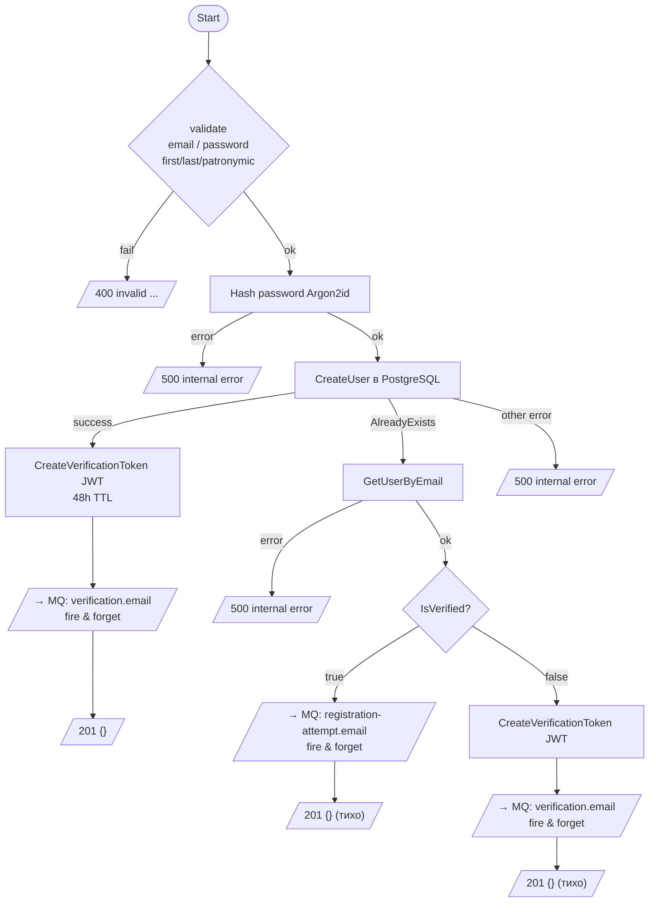
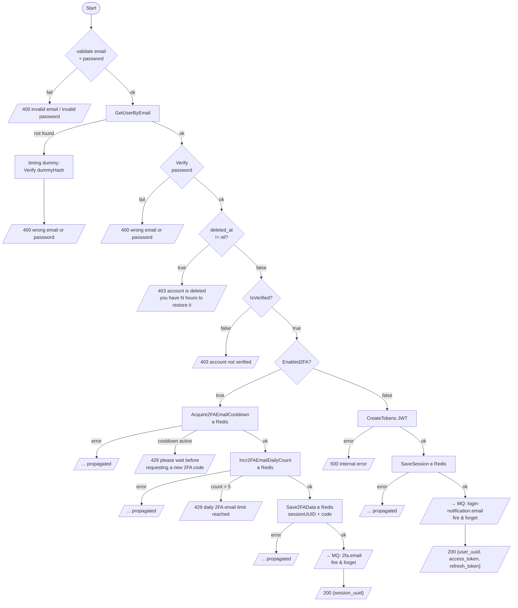
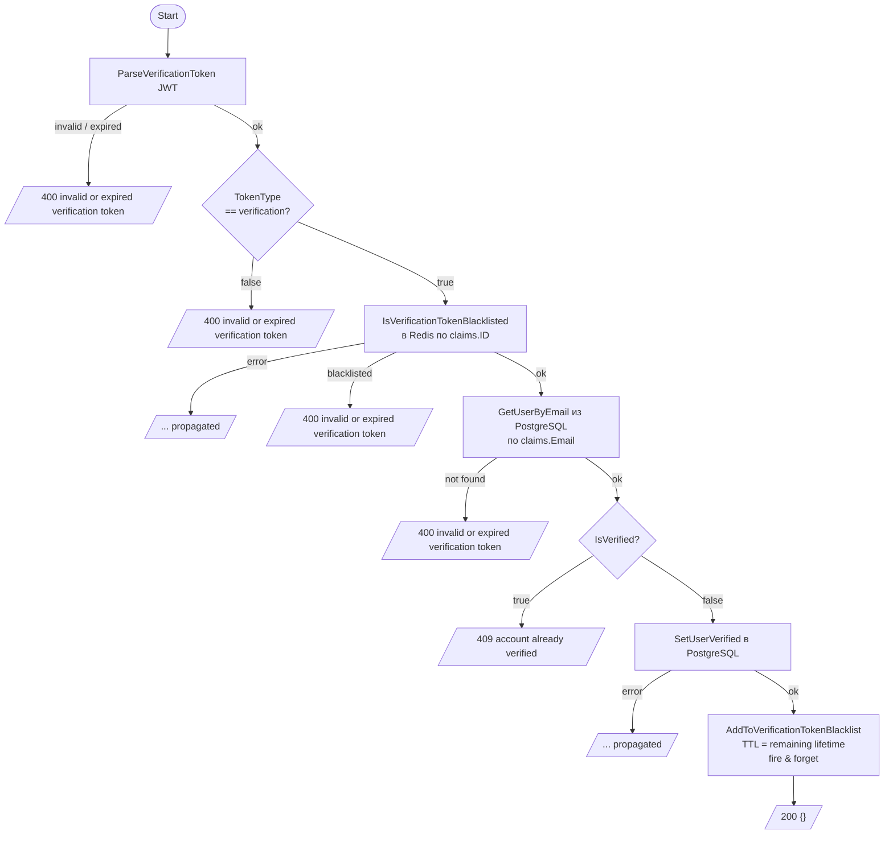
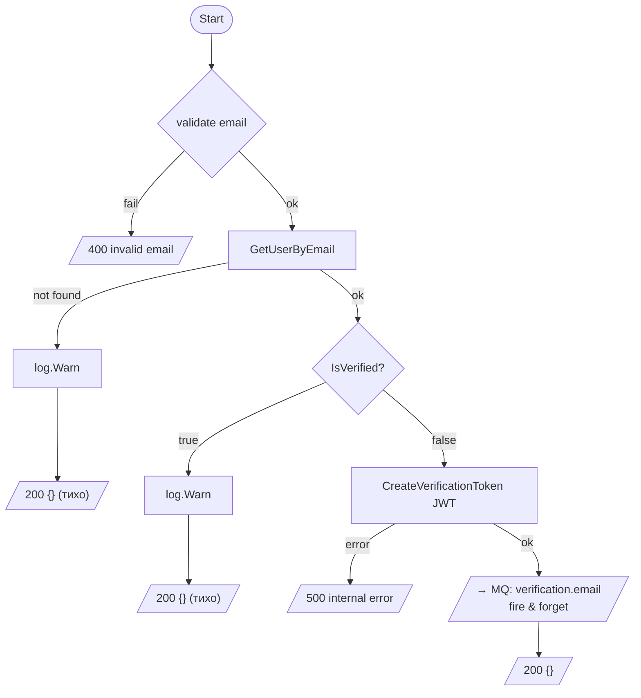
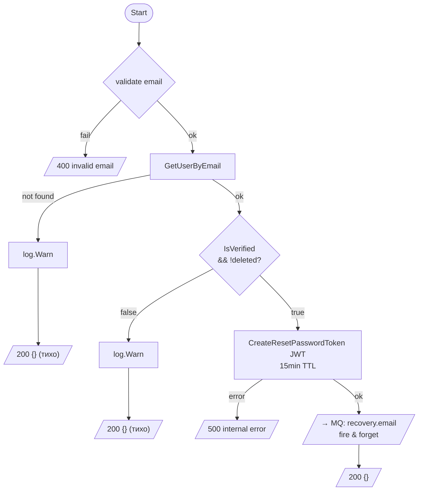
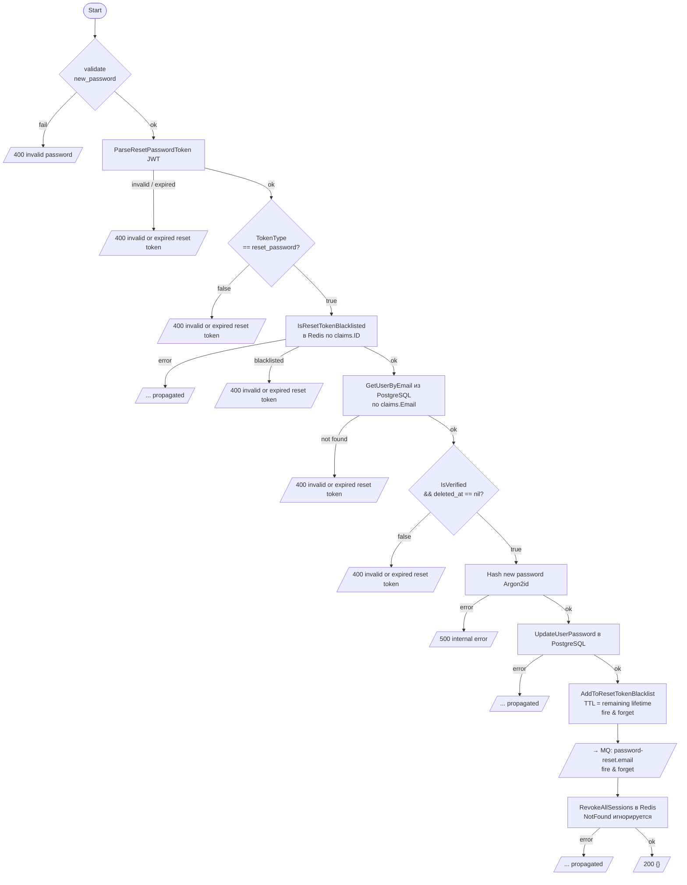
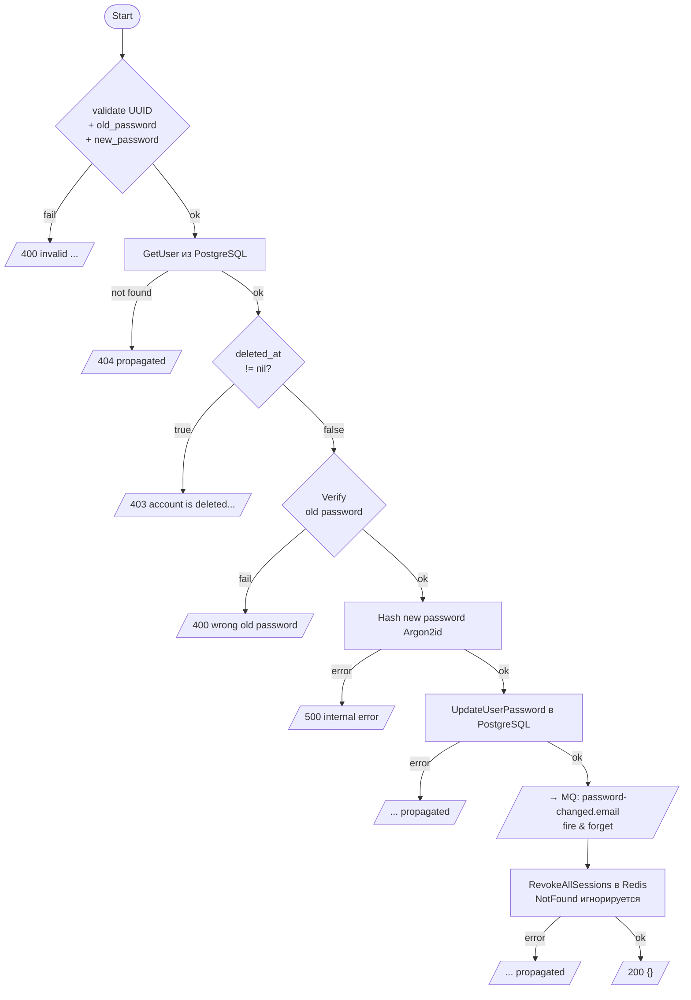
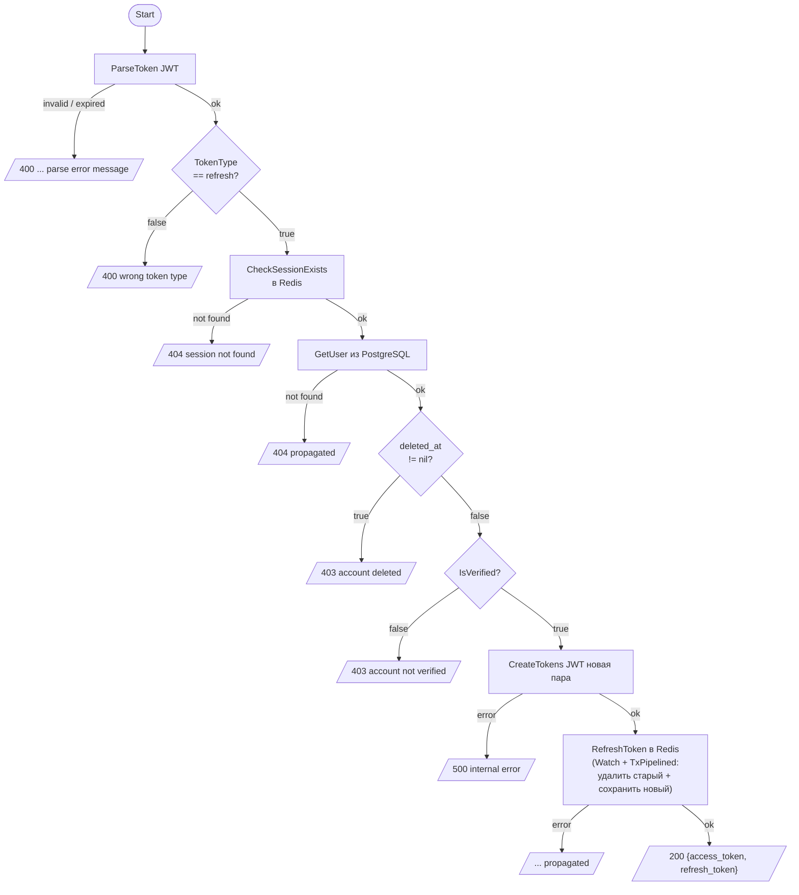
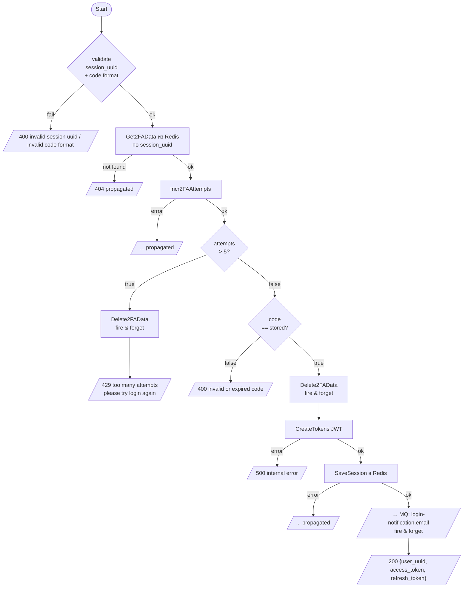
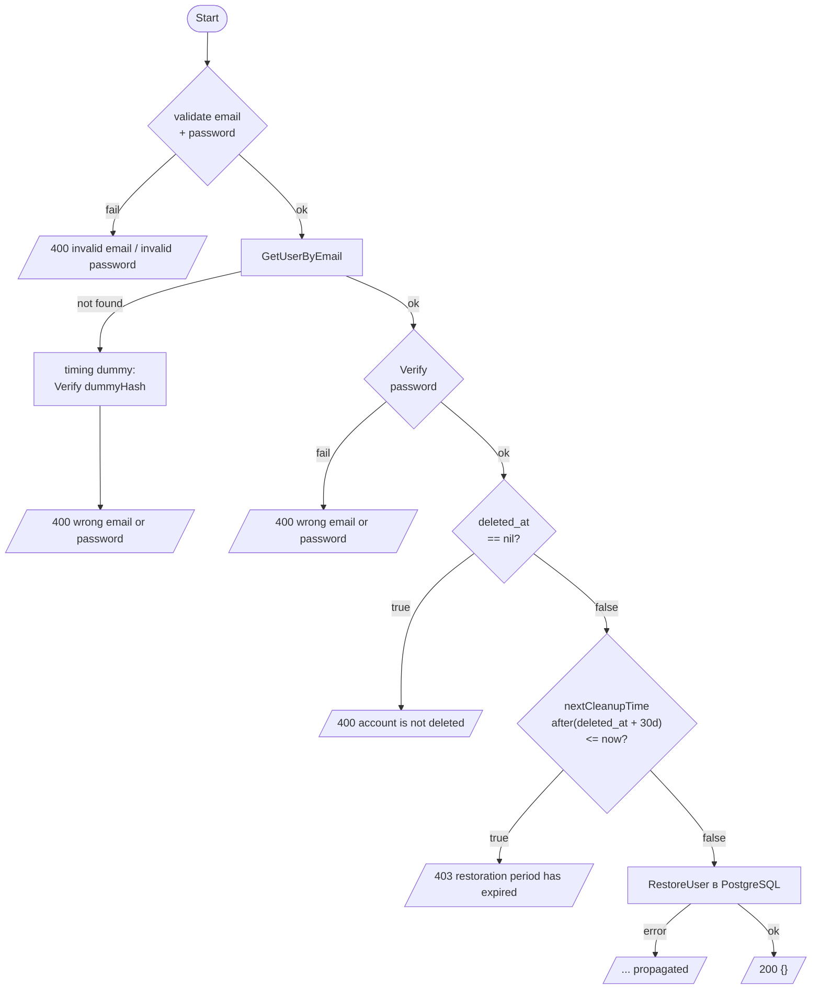

# Flowcharts методов auth сервиса

Методы с нетривиальной логикой ветвлений. Линейные методы (UpdateUserBio,
GetAllActiveSessions, RevokeSession, UpdateUser2FA) не включены.

Все защищённые маршруты (`/auth/*`) неявно добавляют **401** от JWT middleware до вызова сервиса.

---

## Register

`POST /api/register`

Email-enumeration protection: все ветви (новый пользователь, email занят верифицированным,
email занят неверифицированным) возвращают одинаковый **201 {}**.

---

## Login

`POST /api/login`

---

## VerifyAccount

`POST /api/user/verify`

Использует JWT magic-link (одноразовый, TTL 48h). После подтверждения токен добавляется
в blacklist в Redis с TTL = оставшееся время жизни токена.

---

## ResendVerificationCode

`POST /api/user/verify/resend`

Не раскрывает, есть ли email в системе или верифицирован ли аккаунт.

---

## ForgotPassword

`POST /api/forgot-password`

Не раскрывает состояние аккаунта.

---

## ResetPassword

`POST /api/reset-password`

Использует JWT из письма (одноразовый, TTL 15min). После сброса токен добавляется
в blacklist, затем отзываются все активные сессии.

---

## ChangePassword

`PATCH /auth/user/password`

---

## RefreshToken

`POST /api/refresh`

---

## Verify2FA

`POST /api/verify-2fa`

---

## RestoreAccount

`POST /api/restore-account`

