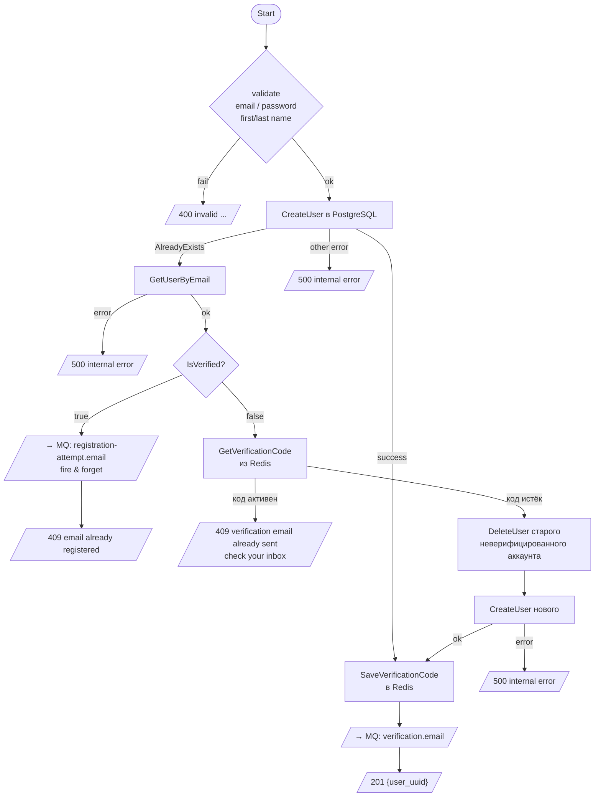
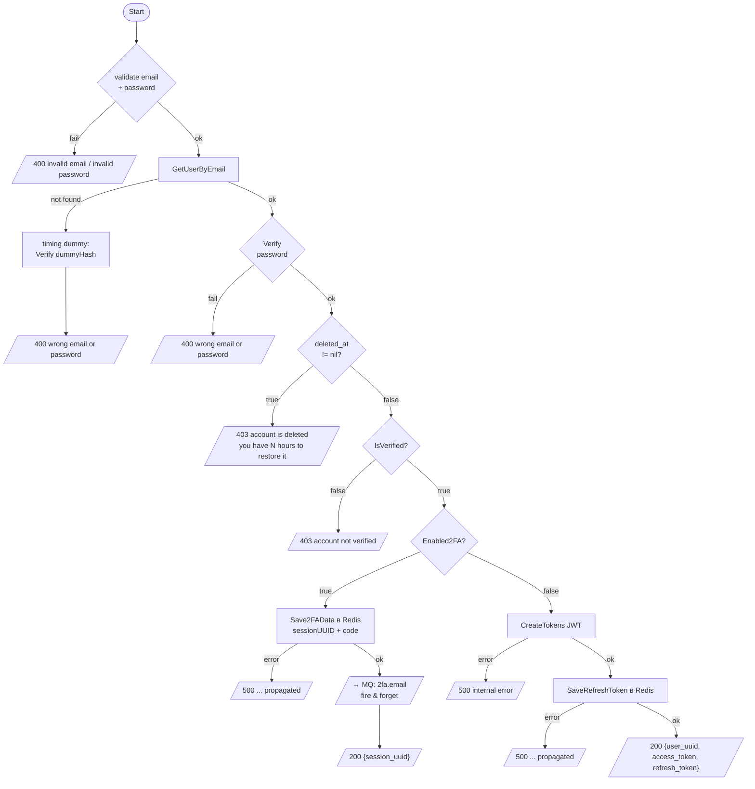
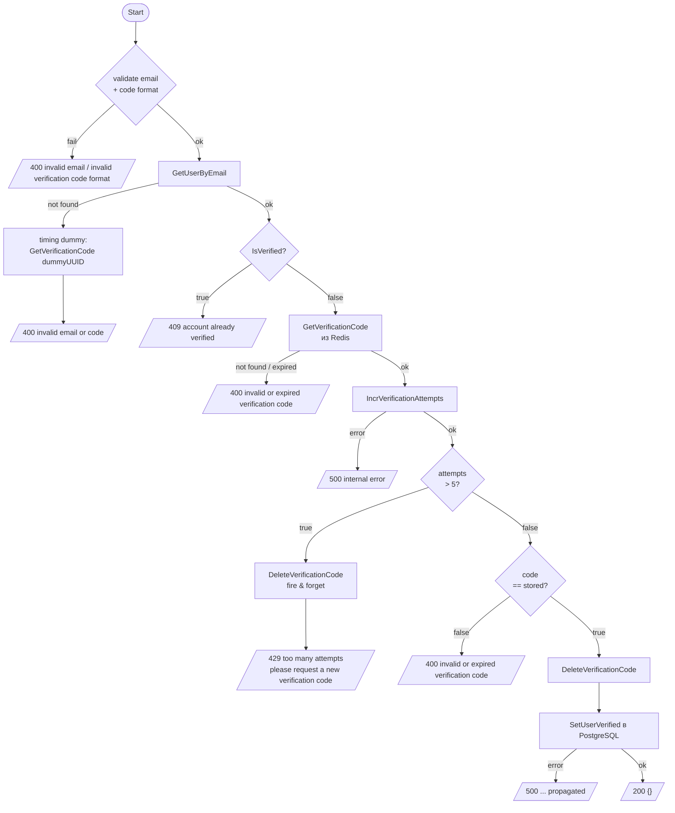
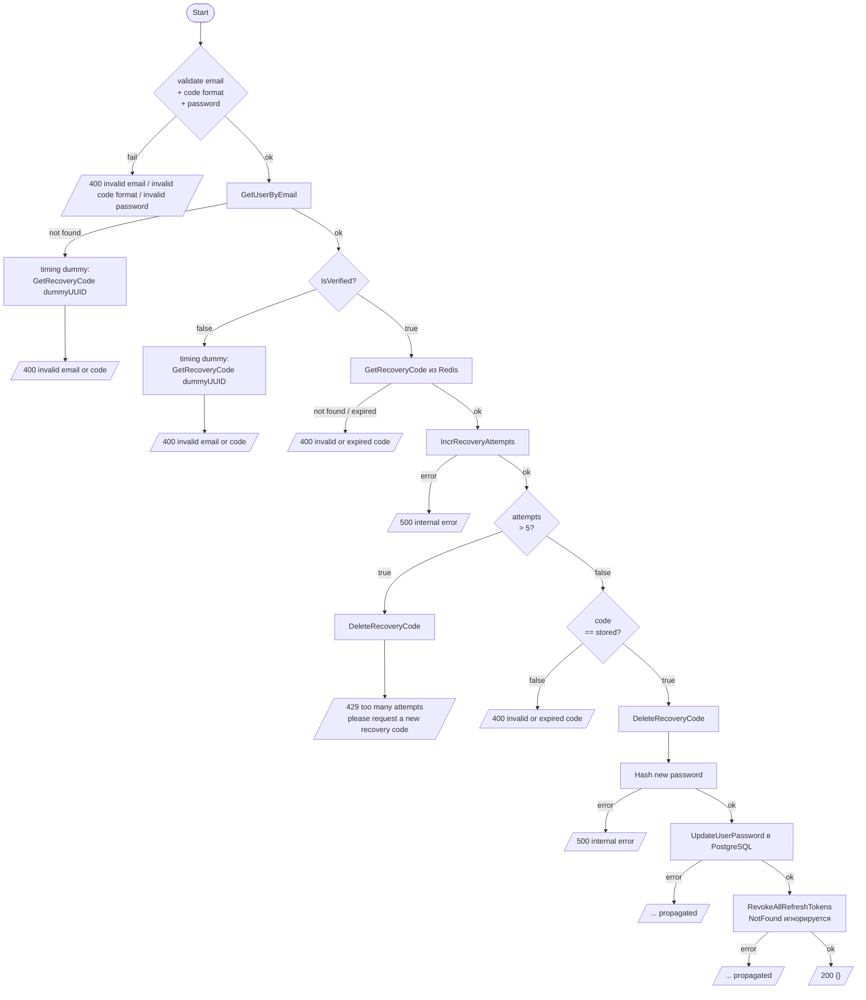
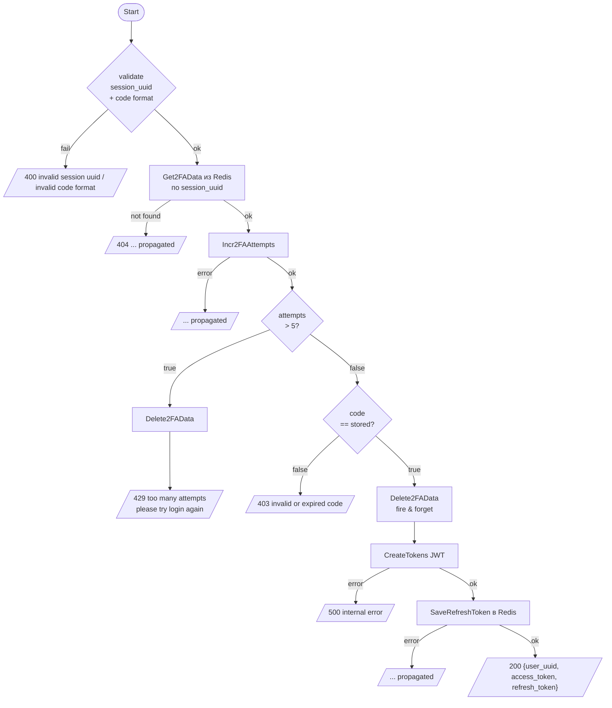
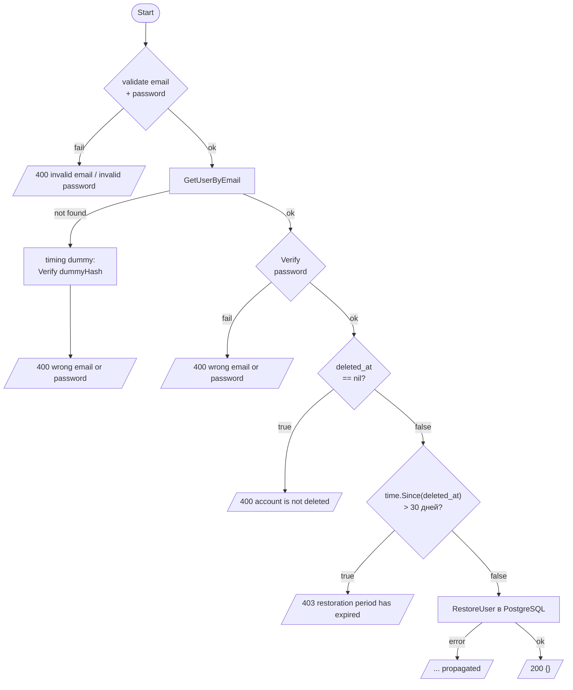
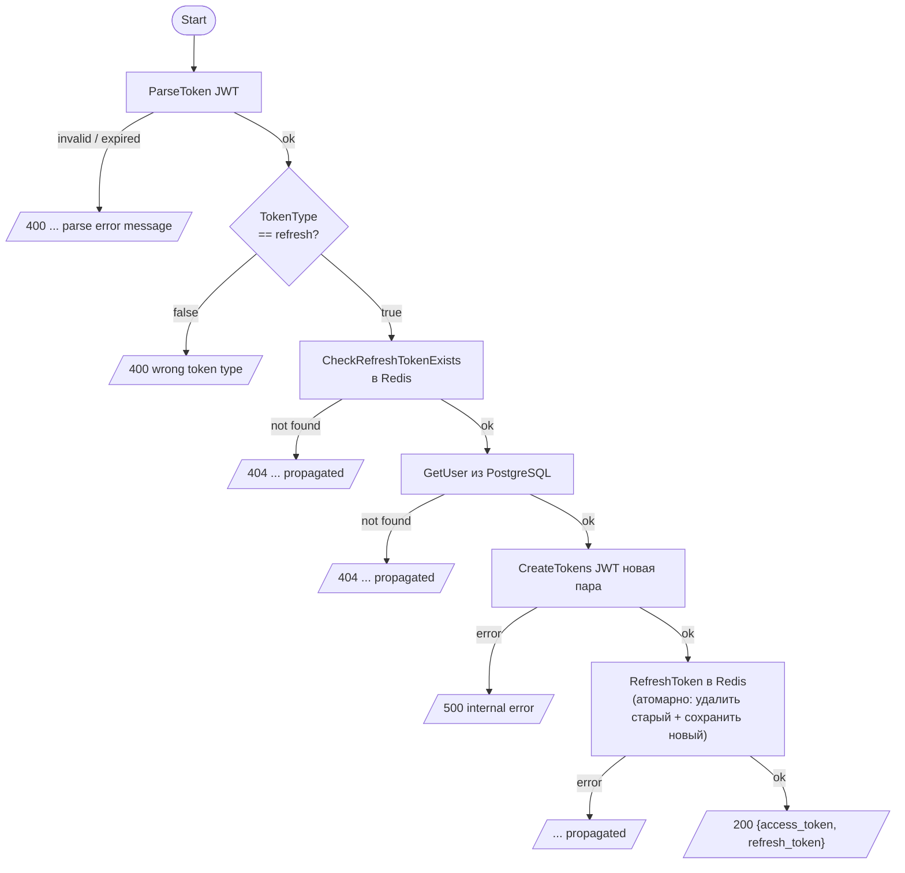

# Flowcharts методов auth сервиса

Методы с нетривиальной логикой ветвлений. Линейные методы (UpdateUserBio, RevokeToken,
GetAllActiveTokens, UpdateUser2FA) не включены.

Все защищённые маршруты (`/auth/*`) неявно добавляют **401** от JWT middleware до вызова сервиса.

---

## Register

`POST /api/register`

---

## Login

`POST /api/login`

---

## VerifyAccount

`POST /api/user/verify`

---

## ResetPassword

`POST /api/reset-password`

---

## Verify2FA

`POST /api/verify-2fa`

---

## RestoreAccount

`POST /api/restore-account`

---

## RefreshToken

`POST /api/refresh`

