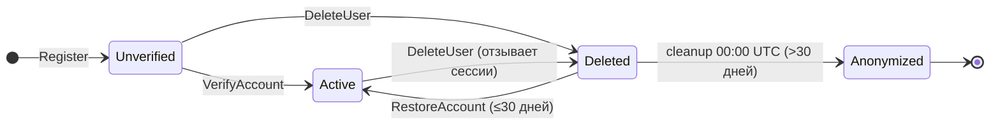

# Жизненный цикл аккаунта

## Диаграмма состояний

---

## Таблица переходов

| Из | В | Метод | Ключевое условие | Side effects |
|---|---|---|---|---|
| — | Unverified | `Register` | уникальный email | → письмо верификации (JWT magic-link) |
| Unverified | Active | `VerifyAccount` | верный JWT токен, не в blacklist | токен добавляется в Redis blacklist |
| Unverified | Deleted | `DeleteUser` | initiator == target (из JWT) | отзыв сессий |
| Active | Deleted | `DeleteUser` | initiator == target (из JWT) | отзыв всех сессий |
| Deleted | Active | `RestoreAccount` | верный пароль, ≤30 дней | — |
| Deleted | Anonymized | cleanup worker | `deleted_at < now - 30d`, 00:00 UTC | email/name/password_hash → NULL |

---

## Доступные операции по состоянию

| Операция | Unverified | Active | Deleted | Anonymized |
|---|:---:|:---:|:---:|:---:|
| Login | ✗ 403 | ✓ | ✗ 403 | ✗ 400¹ |
| VerifyAccount | ✓ | ✗ 409 | ✓² | ✓² |
| ChangePassword | ✓ | ✓ | ✗ 403 | ✗ 403 |
| UpdateUserBio | ✓ | ✓ | ✗ 403 | ✗ 403 |
| UpdateUser2FA | ✓ | ✓ | ✗ 403 | ✗ 403 |
| DeleteUser | ✓ | ✓ | ✗ 404 | ✗ 404 |
| RestoreAccount | ✓³ | ✗ 400 | ✓ | ✗ 400¹ |
| RefreshToken | ✓ | ✓ | ✗ 403⁴ | ✗ 403⁴ |
| GetUser | ✓ | ✓ | ✓ (deleted_at≠"") | ✓ (поля="") |

¹ email = NULL → не находится по email → "wrong email or password"  
² JWT токен может оставаться действительным после удаления; `VerifyAccount` не проверяет `deleted_at`  
³ восстанавливается в **Unverified** — нужна повторная верификация  
⁴ защищено косвенно: `DeleteUser` отзывает все сессии; `CheckSessionExists` вернёт 404
